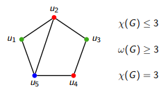
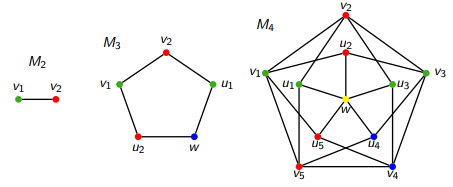

Coloreo de Grafos
=================

* Un coloreo (válido) de los nodos de un grafo `G = (V, X)` es una asignación `f : V → C`, tal que `f(v) ≠ f (u), ∀(u, v) ∈ E`.

* Los elementos de `C` son llamados colores. Muchas veces los colores son enteros positivos.

* Para todo entero positvo `k`, un `k-coloreo` de `G` es un coloreo de los nodos de `G` que usa exactamente `k` colores.

* Un grafo `G` se dice `k-coloreable` si existe un `k-coloreo` de `G`.

* El número cromático de `G`, `χ(G)`, es el menor número de colores necesarios para colorear los nodos de `G`.

* Un grafo `G` se dice `k-cromático` si `χ(G) = k`.

Ejemplos
----------------
* `χ(Kₙ) = n`.
* Si `G` es un grafo bipartito con `m > 0`, entonces `χ(G) = 2`.
* Si `H₂ₖ` es un circuito simple par, entonces `χ(H₂ₖ) = 2`.
* Si `H₂ₖ₊₁` es un circuito simple impar, entonces `χ(H₂ₖ₊₁) = 3`.
* Si `T` es un árbol con `n > 1`, entonces `χ(T) = 2`.

Cotas para χ
------------
* **Proposición**: Si `H` es un subgrafo de `G` entonces `χ(H) ≤ χ(G)`.

* **Definición**: Una clique en un grafo es un subgrafo completo maximal. El número clique `ω(G)` de un grafo es el número de nodos de una clique máxima de `G`.

* **Proposición**: Para cualquier grafo `G`, `χ(G) ≥ ω(G)`.
    * ¿Es buena esta cota?

    

Grafos de Mycielski
-------------------
Definición (por inducción):
1. `M₁ = K₁`
2. `M₂ = K₂`
3. Para `i ≥ 2`, `Mᵢ₊₁` se construye a partir de Mᵢ de la siguiente forma:
    * Si `Mᵢ` tiene `p` nodos, `v₁, ..., vₚ`, `Mᵢ₊₁` tendrá `2p+1` nodos, `v₁, ..., vₚ, u₁, ..., uₚ, w`, donde `uᵢ` es copia de `vᵢ`.
    * El conjunto de aristas de `Mᵢ₊₁` tendrá todas las aristas de `Mᵢ` las aristas uniendo `uᵢ` con los vecinos de `vᵢ` en `Mᵢ` y las aristas uniendo `w` con cada `uᵢ`.

    

* Preguntas frecuentes:
    * ¿Cuál es el número cromático de `Mᵢ`?
        * `χ(Mᵢ) = i`
    * ¿Cuál es la clique máxima de `Mᵢ`?
        * `ω(Mᵢ) = 2`

Cotas para χ
------------
* **Proposición**: Si `∆(G)` es el grado máximo de `G` entonces `χ(G) ≤ ∆(G) + 1`.

* **Teorema (Brooks)**: Sea `G` un grafo conexo que no es un circuito impar ni un grafo completo. Entonces `χ(G) ≤ ∆(G)`.

* Preguntas frecuentes:
    * ¿Son buenas estas cotas?

Problema de los cuatro colores
------------------------------
* **Teorema de los 4 colores (Appel, Haken, 1976)**: Si `G` es un grafo planar, entonces
`χ(G) ≤ 4`.

* **Teorema (Heawood, 1890)**: Si `G` es un grafo planar, entonces `χ(G) ≤ 5`.

Algoritmos para coloreo de grafos
---------------------------------
* Problema difícil, computacionalmente no resuelto.
* No se conocen algoritmos polinomiales para calcular `χ(G)` dado un grafo general `G`.
* Existen muchos enfoques algorítmicos para este problema:
    * Heurísticas y metaheurísticas.
    * Algoritmos basados en backtracking (por ejemplo: DSATUR, Brelaz, 1979).
    * Algoritmos exactos basados en programación lineal entera.

Algoritmo (heurística) secuencial (S)
-------------------------------------
* Dado un orden `v₁, ..., vₙ` de `V`, asignar en el paso `i` el menor color posible en `ℕ` a `vᵢ`, para `i = 1, ..., n`.
* Entrada: Un grafo `G` con un orden en los nodos `v₁, ..., vₙ`.

```
f (v₁) := 1

para i = 2, 3, ..., n hacer
    f (vᵢ) = mín{
                h / h≥1 y f(vⱼ)≠h ∀(vⱼ,vᵢ)∈E, 
                1 ≤ j ≤ i−1
             }
fin para

retornar coloreo definido por f
```

Algoritmo secuencial (S)
------------------------
* Definimos `uS(G, v₁, v₂, ..., vₙ) = máx{1≤i≤n} mín{i, d(vᵢ) + 1}`.

* **Proposición**: Si `χₛ(G)` es el número de colores usado por el algoritmo secuencial para colorear `G` cuando los nodos son considerados en el orden `v₁, ..., vₙ`, entonces `χ(G) ≤ χₛ(G) ≤ uS(G, v₁, v₂, ..., vₙ)`.

* Preguntas frecuentes:
    * ¿Importa el orden en que se colorean los nodos con el algoritmo secuencial?

Algoritmo secuencial (LFS)
--------------------------
* **Orden Largest First (LF)**: los nodos son ordenados de mayor grado a menor grado, `d(u₁)≥d(u₂)≥...≥d(uₙ)`.

* **Proposición**: Si `uLF(G) = uS(G, u₁, u₂, ..., uₙ)` donde `u₁, u₂, ..., uₙ` están ordenados según LF. Entonces `uLF(G) ≤ mín  uS(G, v₁, v₂, ..., vₙ)` donde el mínimo está tomado sobre todos los ordenes posibles `v₁, ..., vₙ`.

* Preguntas frecuentes:
    *   ¿Esto implica que siempre el algoritmo secuencial da un resultado mejor si se usa LF?

* Otra cota (mejor) para el número de colores usados por el algoritmo secuencial es: `u'ₛ(G, v₁, v₂, ..., vₙ) = 1 + máx{1≤i≤n}{dGᵢ(vᵢ)}` donde `dGᵢ(vᵢ)` es el grado del nodo `vᵢ` en el grafo inducido por `v₁, v₂, ..., vᵢ`.

Algoritmo secuencial (SLS)
--------------------------
* Orden Smallest Last (SL):
    1. poner como `vₙ` el nodo de mínimo grado de `G`.
    2. para `i = n−1, ..., 1` poner como `vᵢ` el nodo de grado mínimo en el subgrafo de `G` inducido por `V\{vₙ, vₙ₋₁, .., vᵢ₊₁}`.

* Definimos `uSL(G) = 1 + máx{1≤i≤n} mín{1≤j≤i} {dGᵢ(vⱼ)}` donde `dGᵢ(vⱼ)` es el grado del nodo vj en el grafo inducido por `V\{vₙ, vₙ₋₁, .., vᵢ₊₁}`.

Algoritmo secuencial - Cotas
----------------------------

* **Proposición**: Se puede demostrar (ejercicio) que:
    * `χSLS(G) ≤ uSL(G)`.
    * `uSL(G) ≤ uLF(G)`.
    * SLS colorea un grafo planar con 6 colores o menos.

Algoritmo secuencial con intercambio (SI)
-----------------------------------------
* Supongamos que tenemos un coloreo parcial de `G`, donde los nodos `v₁, v₂, ..., vᵢ₋₁` ya han sido coloredos y es el turno de colorear a `vᵢ`. Si todos los colores ya utilizados están en la vecindad de `vᵢ`, será necesario utilizar un nuevo color.

* Si existen `p` y `q` dos colores utilizados en el coloreo parcial, tal que en todas las componenetes conexas de `Hpq` los nodos adyacentes a `vᵢ` tienen el mismo color, podemos intercambiar los colores `p` y `q` en las componentes de `Hpq` con nodos adyacentes a `vᵢ` con color `p`.

* De esta manera, obtendremos un coloreo parcial de `G` con el color `p` no utilizado en la vecindad de vi.

* Este procedimiento se llama `p,q-intercambio`.

```
f (v₁) := 1, k := 1

para i = 2,3,...,n hacer
    g := mín{h / h≥1 y f(vⱼ)≠h ∀(vⱼ,vᵢ)∈E, 
        1 ≤ j ≤ i−1}
    
    si g ≤ k entonces
        f(vᵢ) := g
    sino
        si existen 1≤p<q≤k, tales que un p,q-intercambio libera p entonces
            realizar el p,q-intercambio
            f(vᵢ) := p
        sino
            f(vᵢ) := g
            k := k + 1
        fin si
    fin si
fin para
```

Algoritmo secuencial con intercambio (SI)
-----------------------------------------

* No siempre es mejor el algoritmo SI que el algoritmo S.
* **Proposición**: Se puede demostrar que:
    * SI colorea un grafo bipartito con 2 colores (ejercicio).
    * SI con el ordenamiento SL colorea un grafo planar con 5 colores como máximo.

Algoritmo secuencial con bracktracking (exacto)
-----------------------------------------------
* Se hace una búsqueda exhaustiva. En el árbol de enumeración, cada nodo de nivel `i` corresponde a un coloreo de `v₁, ..., vᵢ₋₁`.
* Se avanza por las ramas coloreando los siguientes vértices hasta que ocurre alguna de las siguientes situaciones:
    1. Se llegó a un vértice sin colores disponibles: se hace backtracking a partir de `vᵢ₋₁` (nodo anterior).
    2. Se coloreó `vₙ`: se encontró un nuevo coloreo del grafo, actualizamos el mejor número de colores `q` y se continúa con backtracking.
    3. Se llega a un coloreo parcial con más de `q` colores: este coloreo seguro no será mejor que el actual, se hace backtracking.

Algoritmo secuencial con bracktracking con poda (exacto)
--------------------------------------------------------
* `Uᵢ` = conjunto de colores posibles para el nodo `vᵢ`, una vez que han sido coloreados `v₁, ..., vᵢ₋₁`.
* Si `lᵢ₋₁` es el máximo color usado para `v₁, ..., vᵢ₋₁` y sólo buscamos coloreos óptimos, evitando coloreos equivalentes, `∀j ∈ Uᵢ` se verifica que:
    * `j` no es color asignado a un vecino de `vᵢ` ya coloreado
    * `j ≤ d(vᵢ) + 1`
    * `1 ≤ j ≤ lᵢ₋₁ + 1`
    * si ya se encontró un coloreo del grafo con q colores entonces `j ≤ q−1`

Algoritmo secuencial con bracktracking (exacto)
-----------------------------------------------
* `q`: cantidad de colores usados en la mejor solución encontrada hasta el momento.
* `k`: nodo siendo considerado.
* `l`: cantidad de colores utilizados en la solución parcial actual.
* `lₖ`: `l` para el nodo `vₖ`.
* `cotaInf`: cota inferior para el número cromático del grafo.

```
f(v₁) := 1
q := n + 1
k := 1
l := 1
avanzar := VERDADERO

repetir
    si avanzar
        k := k + 1
        lₖ := l
        determinar Uₖ
    fin si

    si Uₖ = ∅
        avanzar := FALSO
        k := k − 1
        l := lₖ
    sino
        j := mín Uₖ
        Uₖ := Uₖ \ {j}
        f(vₖ) := j

        si j > l
            l := l + 1
        fin si
        
        si k < n 
            avanzar := VERDADERO
        sino
            almacenar la nueva solución
            encontrar el menor i tal que f(vᵢ) = l
            borrar l, l+1, ..., q−1 de U₁, ...,Uᵢ₋₁
            q := l
            l := q − 1
            k := i − 1
            avanzar := FALSO
        fin si
    fin si
hasta k = 1 o q = cotaInf
```

Coloreo de aristas
------------------
* Un coloreo válido de las aristas de un grafo `G` es un asignación de colores a las mismas en la cual dos aristas que tienen un nodo en común no tengan el mismo color.

* El índice cromático `χ'(G)` de un grafo `G` es el menor número de colores con que se pueden colorear las aristas de un grafo.

* **Teorema de Vizing**: Para todo grafo `G` se verifica que `∆(G) ≤ χ'(G) ≤ ∆(G) + 1`.